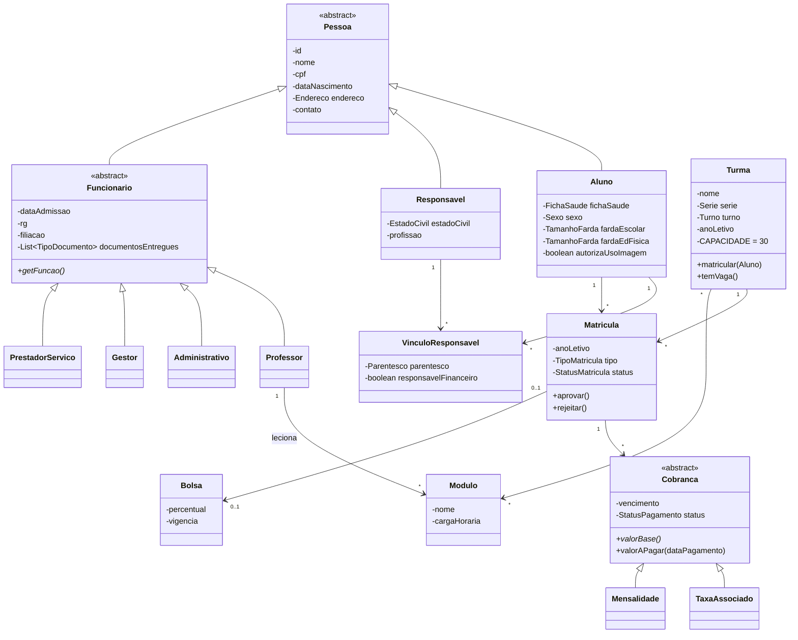

# Sistema Semear — Gestão Escolar

> Projeto da disciplina **Programação Orientada a Objetos** (UNDB).
> Documento de partida: contexto, regras de negócio, modelo de domínio e plano de trabalho.
> Fontes: `Requisitos.pdf`, `Anexo_didatico.docx`, `FICHA_DE_MATRICULA.docx`, `FICHA_DE_ASSOCIADO.docx`, `FICHA_DE_ADMISSAO_FUNCIONARIOS.docx`, `CONTRATO.docx`.

---

## 1. Objetivo

Sistema de gestão escolar para o **Centro Educacional Semeando** (Maternal ao 5º ano), substituindo o controle manual de fichas e contratos. Esta etapa cobre o **núcleo do domínio**:

- cadastro de **alunos** e **responsáveis**;
- gestão de **turmas** e **módulos**;
- gestão de **funcionários**;
- **matrícula** e **cobrança** (regras de negócio da escola).

## 2. Escopo

| Dentro (entrega atual) | Fora (futuro) |
|---|---|
| Alunos, responsáveis e vínculo N:N | Integração bancária Cora |
| Turmas (capacidade de 30) e módulos | Portal web do responsável |
| Funcionários (Professor, Administrativo, Gestor, Prestador) | Obrigações INEP / SMTT / Sistema Presença |
| Matrícula / rematrícula com status | Notificações de cobrança |
| Cálculo de mensalidade, taxa de associado, desconto, bolsa, multa e juros | Planejamento pedagógico (diário, plano de aula) |

> ⚠️ **Assumido:** "módulo" = componente curricular/unidade lecionada em uma turma por um professor. Confirmar com o professor.

---

## 3. Regras de negócio

| ID | Regra | Origem |
|---|---|---|
| RN01 | Cobrança depende da etapa: **Educação Infantil → Taxa de Associado**; **Ensino Fundamental → Mensalidade**. Um aluno tem uma única cobrança mensal. | Requisitos |
| RN02 | Aluno ↔ Responsável é **muitos-para-muitos**. | Requisitos |
| RN03 | Cadastro **único** por aluno; renovação anual é **rematrícula**, não novo cadastro. | Requisitos |
| RN04 | Máximo de **30 alunos por turma**; ao atingir, sinalizar à secretaria e bloquear nova matrícula. | Requisitos |
| RN05 | Pré-matrícula feita pelo responsável; **secretaria aprova ou rejeita**; aprovada vira cadastro principal. | Requisitos |
| RN06 | Coletar tamanho de farda: **uniforme escolar** e **educação física** (separados). | Requisitos |
| RN07 | Educação Infantil formaliza com **Ficha de Sócio**; Ensino Fundamental com **Contrato**. | Requisitos |
| RN08 | **Desconto de 10%** se pago até o vencimento. | Anexo didático |
| RN09 | Atraso: **multa de 2%** + **juros de 0,033% ao dia**. Sem acréscimo se pago até o **5º dia útil** do mês de vencimento. | Contrato, cl. 6 |
| RN10 | Atraso ≥ 30 dias: valor corrigido por INPC *(opcional nesta etapa)*. | Contrato, cl. 6 §1 |
| RN11 | **Bolsa/desconto condicional** concedida a critério da escola, revogável a cada ano letivo; reflete no valor da cobrança. | Contrato, cl. 4 §2 |
| RN12 | Matrícula só é efetivada com a **1ª parcela paga** (arras) e documentos entregues. | Contrato, cl. 5 |
| RN13 | Só se aceita/renova matrícula de aluno **adimplente** (cancelamento/transferência exige quitação). | Contrato, cl. 9 e 11 |

### Tabela de valores (Anexo didático)

| Etapa / Série | Valor | Com desconto (10%) |
|---|---|---|
| Educação Infantil | Taxa de associado R$ 125,00 | — |
| 1º ano | R$ 310,00 | R$ 279,00 |
| 2º ao 5º ano | R$ 375,00 | R$ 337,00 *(ver 7.3)* |
| Jiu Jitsu / Ballet | R$ 50,00 | — |

### Documentos obrigatórios da matrícula (7)

1. Identidade e CPF dos pais/responsáveis
2. Certidão de nascimento (ou RG e CPF) da criança
3. Carteira de vacinação
4. Comprovante de residência
5. Declaração de adimplência (alunos vindos de outras instituições particulares)
6. 2 fotos 3x4
7. Documento das pessoas autorizadas a buscar a criança

---

## 4. Modelo de domínio



### Enums

`Etapa` (EDUCACAO_INFANTIL, ENSINO_FUNDAMENTAL) · `Serie` (MATERNAL_1, MATERNAL_2, INFANTIL_1, INFANTIL_2, ANO_1 … ANO_5, cada uma com sua `Etapa`) · `Turno` (MATUTINO, VESPERTINO) · `StatusMatricula` (PRE_MATRICULA, APROVADA, REJEITADA, ATIVA, CANCELADA) · `TipoMatricula` (NOVA, REMATRICULA) · `StatusPagamento` (PENDENTE, PAGO, ATRASADO) · `Parentesco` · `EstadoCivil` · `TipoDocumento` · `TipoSocio` (FUNDADOR, EFETIVO, MANTENEDOR_C1, MANTENEDOR_C2, MANTENEDOR_C3).

### Pontos de atenção do modelo

- **Responsável de Educação Infantil é também Sócio** (Ficha de Sócio: tipo, nº de filhos, data de associação/afastamento). Sugestão: classe `Socio` associada ao `Responsavel`.
- **Vínculo é classe própria**, pois o parentesco pertence à relação, não à pessoa.
- **`Cobranca` é o ponto de polimorfismo**: `TaxaAssociado` e `Mensalidade` sobrescrevem `valorBase()`; desconto, multa e juros ficam na classe base.
- **Capacidade da turma é regra da própria `Turma`**: `matricular()` lança `TurmaCheiaException`. Nenhuma outra classe deve contar alunos.

---

## 5. Conceitos de POO a demonstrar

| Conceito | Onde aplicar |
|---|---|
| Abstração | `Pessoa`, `Funcionario`, `Cobranca` |
| Herança | `Pessoa → Aluno/Responsavel/Funcionario → Professor…` |
| Polimorfismo | `Cobranca.valorBase()`, `Funcionario.getFuncao()` |
| Encapsulamento | Atributos privados; validações (CPF, capacidade) dentro das classes |
| Interfaces | `Repositorio<T>`, `Cobravel` |
| Composição | `Endereco`, `FichaSaude`, `TamanhoFarda` |
| Exceções próprias | `TurmaCheiaException`, `DocumentoPendenteException`, `MatriculaInvalidaException` |

---

## 6. Estrutura sugerida (Java)

```
src/main/java/br/undb/semear/
├── dominio/          # Pessoa, Aluno, Responsavel, Funcionario, Turma, Modulo, Matricula, Cobranca...
│   └── enums/
├── servico/          # MatriculaService, CobrancaService, TurmaService
├── repositorio/      # interface Repositorio<T> + implementações em memória
├── excecao/
├── util/             # validador de CPF, cálculo de dia útil
└── Main.java
src/test/java/        # JUnit: regras RN04, RN08, RN09
```

Persistência: começar **em memória** (`Map<Integer, T>`). Trocar por arquivo/BD só se a disciplina exigir, sem alterar o domínio (graças à interface `Repositorio`).

---

## 7. Inconsistências nos documentos (decidir com o professor)

1. **Contrato não fecha:** anuidade de R$ 3.720,00 em "11 parcelas de R$ 310,00" = R$ 3.410,00. Já 12 × R$ 310,00 = R$ 3.720,00, e o §1 diz "janeiro a dezembro" (12 meses).
2. **Valor do 3º ano:** o contrato usa R$ 310,00, mas a tabela oficial define R$ 375,00 para 2º–5º ano. **Decisão de design:** o valor deve vir sempre da tabela por série, nunca digitado no contrato.
3. **Arredondamento do desconto:** 10% de R$ 375,00 = R$ 337,50, mas a tabela mostra R$ 337,00. Definir a regra (truncar ou arredondar).
4. **"Anexo I" inexistente:** a cl. 17 do contrato referencia um anexo que não existe.
5. **Endereço da escola inconsistente** entre os documentos (irrelevante para o código, mas não usar como dado fixo).

## 8. Dados sensíveis e LGPD

- **Proibido usar dados reais** (LGPD, art. 14, dados de crianças). Todo teste e demonstração com **dados sintéticos** (CPF `000.000.000-00`, nomes fictícios).
- Tratar como **sensíveis**: `FichaSaude` do aluno (deficiência, alergia, restrição alimentar, acompanhamento) e **autodeclaração étnico-racial** do funcionário. Não imprimir em logs nem em `toString()`.
- Registrar o consentimento de uso de imagem (`autorizaUsoImagem`).

---

## 9. Plano de trabalho

- [ ] **Etapa 1 — Domínio:** enums, `Pessoa` e subclasses, `Turma`, `Modulo`, `Matricula`
- [ ] **Etapa 2 — Regras:** capacidade da turma, fluxo de pré-matrícula, documentos obrigatórios
- [ ] **Etapa 3 — Cobrança:** `Cobranca`, desconto, multa/juros, bolsa
- [ ] **Etapa 4 — Persistência e serviços:** repositórios em memória, services
- [ ] **Etapa 5 — Interface:** console (menu) ou a definir
- [ ] **Etapa 6 — Testes e documentação:** JUnit, diagrama final, relatório

### Divisão sugerida (ajustar ao tamanho da equipe)

| Frente | Entidades |
|---|---|
| A — Pessoas | `Pessoa`, `Aluno`, `Responsavel`, `VinculoResponsavel`, `Socio` |
| B — Funcionários | `Funcionario` e subclasses, documentos de admissão |
| C — Acadêmico | `Turma`, `Modulo`, `Serie`, `Matricula` |
| D — Financeiro | `Cobranca`, `TaxaAssociado`, `Mensalidade`, `Bolsa`, tabela de preços |

## 10. Convenções

- Java 17+, nomes de classes e métodos em **português** (domínio), sem acentos nos identificadores.
- Uma classe por arquivo; atributos `private`; construtores validam estado inválido.
- Commits pequenos, mensagem no imperativo (`Adiciona regra de capacidade da turma`).
- Cada regra RNxx deve ter pelo menos **um teste** referenciando o ID no nome (`rn04_naoMatriculaAcimaDe30`).
